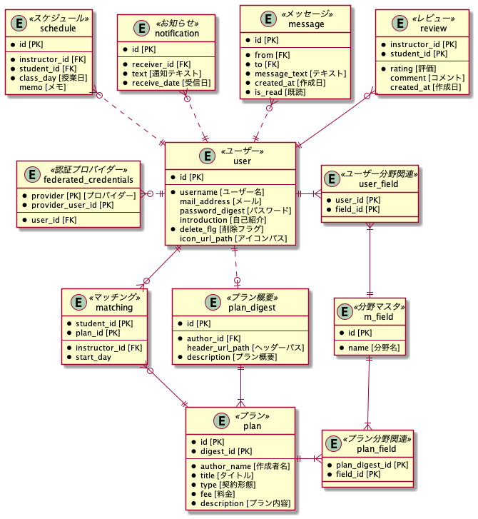

# ポートフォリオ　「スタラボ」　のリポジトリ
## 概要
数学や物理などの理数系の科目を教えられる人と学びたい人のマッチングサイトです。 
社会人で学び直したい方やもっと深く学ぶために有識者に教えを請いたい人のためのサービスです。 
登録さえすれば誰とでもマッチングできるようになります。

## 使用技術
- React（主にhooks）
- Node.js（TypeScript）
- Express
- Jest
- Nginx
- Redis
- Docker/Docker-compose（開発環境のみ）
- AWS
  - VPC
  - EC2
  - RDS
  - Route53
  - ALB
  - Auto Scaling
  - CloudFront
  - CloudWatch
  - CodeDeploy
  - S3
  - ACM
- Terraform
- GithubActions
- Datadog

## 機能一覧
- ユーザー登録、ログイン機能（メール or Google認証）
- プラン作成、編集機能
- レビュー機能
- 講師検索機能
- マッチング機能
- メッセージ機能
- プロフィール作成、編集機能
- 契約、契約解除機能
- スケジューリング機能
- 通知機能

## インフラ構成図
## テーブル設計

## エンドポイント
| エンドポイント | メソッド | 説明 |
| :--:      | :--:  | :--- |
| /   | GET   | ホーム画面の表示 |
| /signup | GET/POST | ユーザー登録画面の表示/登録 |
| /signin | GET/POST | ログイン画面の表示/ログイン　　　|
| /users/:id | GET | ユーザーの表示/編集/削除 |
| /users/:id/message | POST | メッセージ送信 |
| /plans | GET/POST | プラン一覧画面の表示/プランの作成・編集|
| /plans/:digest_id | GET | プラン画面の表示 |
| /plans/:digest_id/:plan_id | DELETE | プランの削除 |
| /schedules/:id | GET/POST/PUT/DELETE | スケジュール情報の取得/作成/編集/削除 |
| /me/messages | GET | メッセージ一覧の表示 |
| /me/users/:user_id/messages | GET | 特定の人とのメッセージ一覧の表示 |
| /me/notifications | GET | お知らせの表示　|
| /me | GET/PUT/DELETE | プロフィールの表示/編集/削除　|
| /me/settinngs/profile | GET/PUT | プロフィール設定画面の表示/編集 |
| /me/settings/plans | GET | 契約プラン一覧の表示 |
| /me/settings/users | GET | 契約生徒一覧の表示 |
| /me/settings/schedules | GET | 授業スケジュールの表示 |
| /me/plans/edit | GET | プラン編集画面の表示 |
| /me/plans/:id | DELETE | 契約プランの解除 |
| /me/users/:id | DELETE | 契約生徒の解除 |
| /contract | GET/POST | お問い合わせ　 |
| /password/reset | GET/POST | パスワードのリセット申請　|
| /password/new | GET/POST | パスワードのリセット　　|
| /version | GET | バージョン情報の取得 |
| /health | GET | ヘルスチェック |
